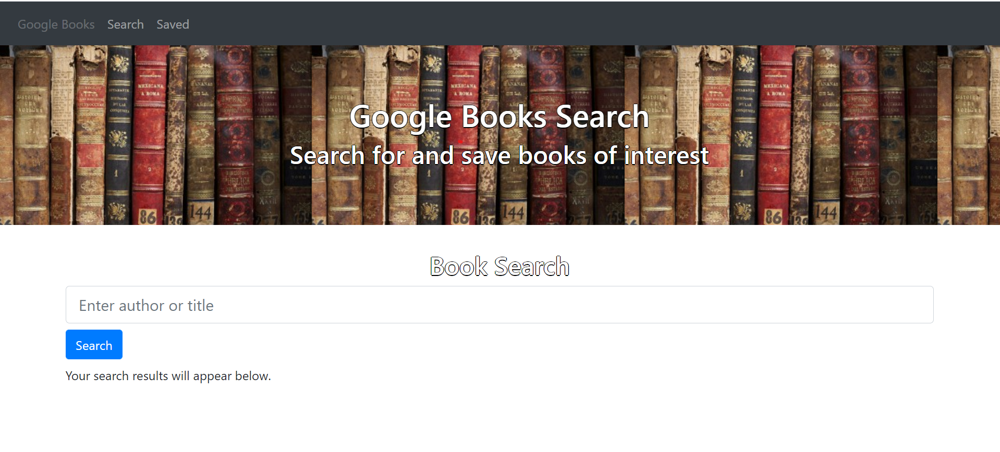
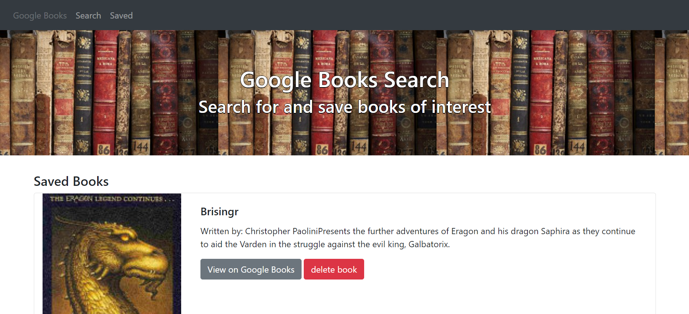

# Google-Books-App
An application that gives you the ability to search for books and save your favourite books for later.

## Contents
Section | Description
------------ | -------------
[Deployment](#Deployment) | Link to the Deployed Application
[Technologies](#Technologies) | Technologies Used
[Installation](#Installation) | Installation Information
[Usage](#Usage) | How to use the application
[Screenshots](#Screenshots) | Screenshots of the deployed application
[Licence](#licence) | Licence for the source code
[Questions](#Questions?) | Where you can reach me

## Deployment
OPEN GOOGLE-BOOKS-APP ---> [HERE](https://dashboard.heroku.com/apps/g00gle-books-app)

## Technologies Used

- HTML
- CSS
- Bootstrap
- React
- JavaScript
- mongoDB
- Heroku

## Installation
 To run this application locally, do the following:
 - (i) Clone this repository from GitHub
- (ii) This app contains a package.json so you just need to run `npm i` from the root directory to install the relevant dependencies
- (iii) Then run `npm start` in the terminal from the root directory 

## Usage
You may do either of the following:
* Follow the installation instructions above to run the app on your local device.
* Use the deployed application, found at the top of this README

## Screenshots
Application in action --->

## License

> This project was created under the standard MIT licence.

> [Learn more about this licence.](https://lbesson.mit-license.org/)

## Questions?

Please contact me through my GitHub provided below if you have any questions relating to how the application works or any of my other projects

My GitHub username is Robbie-Bridgwater

Link to my GitHub Profile ---> https://github.com/Robbie-Bridgwater